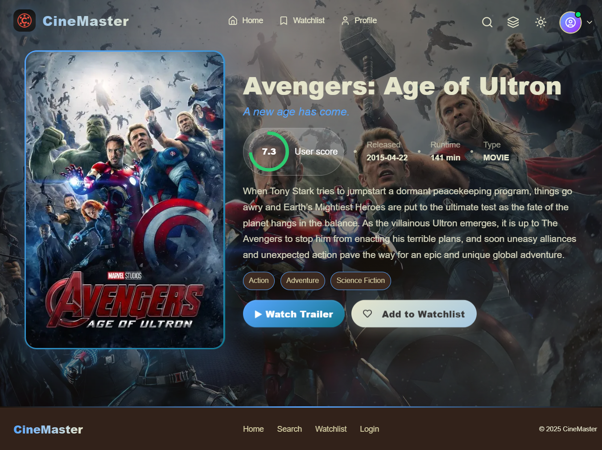
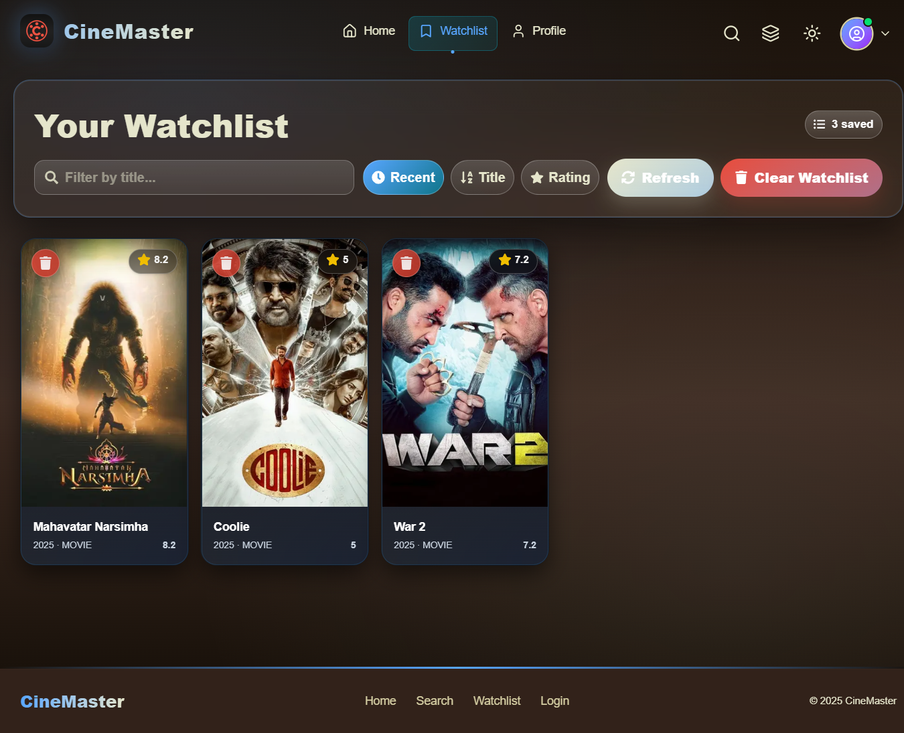

# 🎬 CineMaster  

> **CineMaster** is a modern full‑stack movie discovery platform where users can explore trending films and TV shows, search for their favorites, and view rich details — all from a beautifully responsive interface.  
> Built with **Next.js App Router** on the frontend, a secure **Node.js + Express.js** backend, **JWT authentication**, and **MongoDB Atlas** for cloud storage, CineMaster offers a seamless cinematic experience powered by The Movie Database (TMDb) API.

[](https://cine-master-flame.vercel.app/)  
[](https://render.com/)  

---

## 📑 Table of Contents
- [📸 Preview](#-preview)
- [✨ Features](#-features)
- [🛠 Tech Stack](#-tech-stack)
- [📂 Project Structure](#-project-structure)
- [⚙️ Installation & Setup](#️-installation--setup)
- [📡 API Routes](#-api-routes)
- [🤝 Contributing](#-contributing)
- [❤️ Acknowledgements](#️-acknowledgements)

---

## 📸 Preview  

### **Homepage (Hero Section)**  
  

---

### **Search Results**
  

---

### **Movie Details Page**  
  

---

### **Watchlist**  
  

---

## ✨ Features  

### **User Experience**
- 🔥 **Trending Movies & Shows** — Real‑time from TMDb API.
- 🔍 **Powerful Search** — Accurate, instant movie & TV results.
- 🎬 **Detailed Info Pages** — Synopsis, ratings, cast, genres, release date.
- ❤️ **Personal Watchlist** — Save movies for later viewing.
- 📱 **Responsive UI** — Optimized for desktop, tablet, and mobile.
- 🎨 **Smooth Animations** — Motion transitions with Framer Motion.

### **Developer / Backend**
- ⚡ **Next.js App Router** with server-side rendering for fast loads.
- 🗃 **MongoDB Atlas** — Scalable cloud-hosted database.
- 🔐 **JWT Authentication** — Secure user login & signup.
- 🛡 **Password Hashing** — `bcrypt.js` for safe credential storage.
- 🌐 **REST API** — Express.js backend deployed via Render.
- ⚙ **Config Management** — `dotenv` for environment variables.

---

## 🛠 Tech Stack  

| **Frontend**           | **Backend**    | **Database**   | **Tools / Hosting**          |
|------------------------|---------------|---------------|------------------------------|
| Next.js (App Router)   | Node.js       | MongoDB Atlas | Vercel (Frontend Hosting)    |
| React                  | Express.js    |               | Render (Backend Hosting)     |
| Tailwind CSS           | JWT Auth      |               | Framer Motion (Animations)   |
| Lucide Icons           | bcrypt.js     |               | dotenv (Env Config)          |

---

## 📂 Project Structure  

```plaintext
CineMaster/
│
├── backend/
│   ├── server.js         # Express entry point
│   ├── routes/           # API endpoints (auth, movies)
│   ├── controllers/      # Route business logic
│   ├── models/           # MongoDB models (User, Watchlist)
│   ├── middleware/       # Auth/JWT middleware
│   └── utils/            # Helper functions
│
├── frontend/
│   ├── app/              # Next.js App Router pages
│   ├── components/       # Shared UI components
│   ├── lib/              # API call helpers
│   ├── styles/           # Tailwind & global styles
│   └── public/           # Static assets
│
└── README.md
```

---

## ⚙️ Installation & Setup  

Clone Repository:
```bash
git clone https://github.com/VrajPatel1635/CineMaster.git
```

---

### **Backend Setup**
```bash
cd backend
npm install
```

Create `.env` in **backend**:
```env
PORT=5000
MONGO_URI=your_mongodb_atlas_connection
JWT_SECRET=your_jwt_secret
TMDB_API_KEY=your_tmdb_api_key
```

Run backend:
```bash
npm run dev
```
Backend runs at ➡ `http://localhost:5000`

---

### **Frontend Setup**
```bash
cd frontend
npm install
```
Create `.env.local` in **frontend**:
```env
NEXT_PUBLIC_API_URL=http://localhost:5000
```

Run frontend:
```bash
npm run dev
```
Frontend runs at ➡ `http://localhost:3000`

---

## 📡 API Routes  

**Auth**
| Method | Endpoint               | Description          |
|--------|------------------------|----------------------|
| POST   | `/api/auth/register`   | Create new user      |
| POST   | `/api/auth/login`      | Login user, issue JWT|

**Movies**
| Method | Endpoint                      | Description                    |
|--------|--------------------------------|--------------------------------|
| GET    | `/api/movies/trending`         | Get trending movies & shows   |
| GET    | `/api/movies/search?query=`    | Search for movies/TV          |
| GET    | `/api/movies/:id`              | Get detailed movie info       |

**Watchlist**
| Method | Endpoint              | Description         |
|--------|-----------------------|---------------------|
| GET    | `/api/watchlist`      | Fetch user’s saved movies |
| POST   | `/api/watchlist`      | Add movie to watchlist    |
| DELETE | `/api/watchlist/:id`  | Remove movie from watchlist|

---

## 🤝 Contributing  

1. Fork repository  
2. Create feature branch (`git checkout -b feature/amazing-feature`)  
3. Commit changes (`git commit -m 'Add amazing feature'`)  
4. Push to branch (`git push origin feature/amazing-feature`)  
5. Open Pull Request  

---

## ❤️ Acknowledgements  
- [TMDb API](https://www.themoviedb.org/documentation/api) — movie data powerhouse.  
- [Vercel](https://vercel.com/) — frontend hosting.  
- [Render](https://render.com/) — backend hosting.  
- [MongoDB Atlas](https://www.mongodb.com/atlas) — cloud database.  
